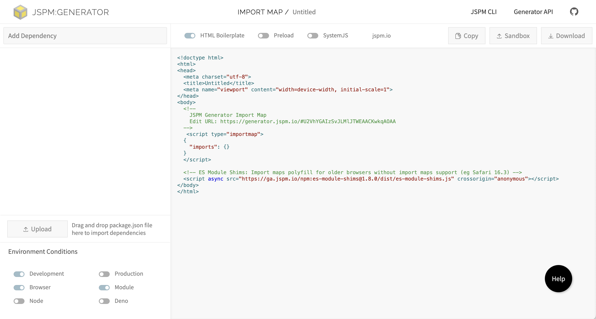
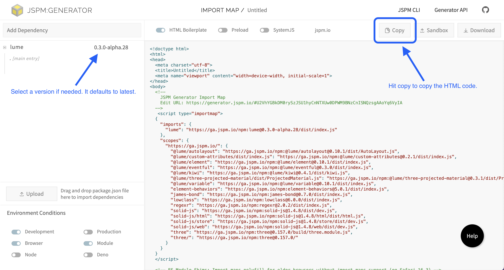

# Install

The following describes ways to install and start using LUME.

> :bulb:**Tip**
>
> This assumes you already know some basics of HTML and JavaScript. If not, you
> might like to start with [Mozilla's intro to
> web](https://developer.mozilla.org/en-US/docs/Learn/Getting_started_with_the_web).

## Install methods

Pick from one of the following install methods:

- [CDN](#cdn-easiest) (easiest, quickest)
  - This method is the quickest to get started with, freat for prototyping new
    web apps with the least amount of friction.
  - If you are completely new to web development or you are not yet familiar
    with [terminals and command
    lines](https://www.davidbaumgold.com/tutorials/command-line/), start here.
  - If you are knowledgeable in web development but your project is simple and
    relying on CDNs for dependencies is ok, start here to get you started as
    quickly as possible without worrying about build setups, terminal commands,
    and configuration.
- [Local Buildless](#local-buildless) (just a little bit less easy)
  - This method is similar to the CDN method, but dependencies will be
    downloaded locally using a package manager after installing
    [Node.js](https://nodejs.org/), an importmap will be created manually, and the
    web app will be launched offline without a network connection using a static
    web server.
  - This method is great for average web apps.
- [Local with Build](#local-with-build-advanced) (advanced, more work)
  - This method also installs dependencies locally with a package manager like
    the Local method, but it additionally uses a build tool for optimization.
  - This method is good for apps that have high traffic and/or require the
    fastest load times possible, but it comes at the cost of managing and
    maintaining a build setup (and the knowledge needed for that).

### CDN (easiest)

This method requires only a text editor, and some basic knowledge of HTML and
JavaScript.

We will get Lume wired into an HTML file by having the HTML file
fetch Lume from a [content-delivery
network](https://www.herocreative.com/dummys-guide-content-delivery-networks/)
(CDN), which is a website that serves files from servers distributed around the
world to maximize download speed. Our HTML file will specify URLs, in the form
of an "importmap", that tell a browser running our web app where to download
Lume from.

We will use `import` statements such as `import 'lume'` in our JavaScript, and
the importmap will inform the browser where to get Lume from.

The CDN that we will use is [JSPM](https://jspm.org). JSPM has an online
importmap generator that will generate a list of URLs that tell a browser to get
Lume from the JSPM CDN.

> :bulb:**Tip**
>
> Learn about importmaps [here](https://developer.mozilla.org/en-US/docs/Web/HTML/Element/script/type/importmap).

To get started, open your favorite text editor.

We'll create a new file that we will save as an HTML file with its name
ending in `.html`. We will then run this file in a web browser. We will be
creating what people commonly describe as a "web site", "web page", or "web
app".

Now visit [JSPM's importmap generator](https://generator.jspm.io). It will look something like this:



In the input at the top left, where it says "Add Depdendency", type `lume` and
hit enter. This will generate HTML code on the right side of the view that you'll copy:



<details><summary><span style="cursor: pointer;">For reference, here is that HTML code you can copy directly from here (click to expand):</span></summary>

<!-- prettier-ignore -->
```html
<!doctype html>
<html>
<head>
  <meta charset="utf-8">
  <title>Untitled</title>
  <meta name="viewport" content="width=device-width, initial-scale=1">
</head>
<body>
  <!--
    JSPM Generator Import Map
    Edit URL: https://generator.jspm.io/#U2VhYGBkDM0rySzJSU1hyCnNTXUw0DPWM9BNzCnISNQzsgAAoYq6VyIA
  -->
		<!-- CONTINUE update with classy-solid in place instead of lume/variable -->
   <script type="importmap">
  {
    "imports": {
      "lume": "https://ga.jspm.io/npm:lume@0.3.0-alpha.28/dist/index.js"
    },
    "scopes": {
      "https://ga.jspm.io/": {
        "@lume/autolayout": "https://ga.jspm.io/npm:@lume/autolayout@0.10.1/dist/AutoLayout.js",
        "@lume/custom-attributes/dist/index.js": "https://ga.jspm.io/npm:@lume/custom-attributes@0.2.1/dist/index.js",
        "@lume/element": "https://ga.jspm.io/npm:@lume/element@0.10.1/dist/index.js",
        "@lume/eventful": "https://ga.jspm.io/npm:@lume/eventful@0.3.0/dist/index.js",
        "@lume/kiwi": "https://ga.jspm.io/npm:@lume/kiwi@0.4.1/dist/kiwi.js",
        "@lume/three-projected-material/dist/ProjectedMaterial.js": "https://ga.jspm.io/npm:@lume/three-projected-material@0.3.1/dist/ProjectedMaterial.js",
        "@lume/variable": "https://ga.jspm.io/npm:@lume/variable@0.10.1/dist/index.js",
        "element-behaviors": "https://ga.jspm.io/npm:element-behaviors@5.0.1/dist/index.js",
        "james-bond": "https://ga.jspm.io/npm:james-bond@0.7.0/dist/index.js",
        "lowclass": "https://ga.jspm.io/npm:lowclass@6.0.0/dist/index.js",
        "regexr": "https://ga.jspm.io/npm:regexr@2.0.2/dist/index.js",
        "solid-js": "https://ga.jspm.io/npm:solid-js@1.4.8/dist/dev.js",
        "solid-js/html": "https://ga.jspm.io/npm:solid-js@1.4.8/html/dist/html.js",
        "solid-js/store": "https://ga.jspm.io/npm:solid-js@1.4.8/store/dist/dev.js",
        "solid-js/web": "https://ga.jspm.io/npm:solid-js@1.4.8/web/dist/dev.js",
        "three": "https://ga.jspm.io/npm:three@0.157.0/build/three.module.js",
        "three/": "https://ga.jspm.io/npm:three@0.157.0/"
      }
    }
  }
  </script>

  <!-- ES Module Shims: Import maps polyfill for older browsers without import maps support (eg Safari 16.3) -->
  <script async src="https://ga.jspm.io/npm:es-module-shims@1.8.0/dist/es-module-shims.js" crossorigin="anonymous"></script>

  <script type="module">
    import * as lume from "lume";

    // Write main module code here, or as a separate file with a "src" attribute on the module script.
    console.log(lume);
  </script>
</body>
</html>
```

</details>

Copy and paste the HTML code into your text editor.

The content inside of the `<script type="importmap">` is the import map -- a
[JSON](https://developer.mozilla.org/en-US/docs/Glossary/JSON)-formatted object
-- that maps the names of libraries (for example the `"lume"` in `import ...
"lume"`) to URLs where they will be downloaded from by the web app. You'll
notice some libraries listed there like `solid-js` and `three`, among others,
which are dependencies of Lume and we also want the browser to know where those
dependencies should come from.

> :bulb:**Tip**
>
> You can simply ignore the importmap, unless you need to install more
> dependencies.

The content inside of the `<script type="module">` element is where we load
Lume, and write any app-specific code.

Save your file with a name ending in `.html`, for example `lume-app.html`.

Now open this file in your favorite browser. You can do so in a few ways,
depending on your operating system and browser:

- drag the file from your file explorer and drop it in your browser
- find the `Open` option in your browser's menu to open the file picker and select the file
- hit `ctrl+o` in Windows or `cmd+o` in macOS to open the file picker and select the file

> [!Important]
> If the install went well, you can open your browser's console, and you will see the
> result of the `console.log(lume)` statement in your browser console.
>
> To learn how to open the console of your favorite browser, see Mozilla's
> [Developer
> Tools](https://developer.mozilla.org/en-US/docs/Glossary/Developer_Tools) doc
> and click the link for your specific browser.
>
> This will be very handy for debugging. If you create any errors in your app,
> you will see the errors in your console.

If you need to import anything else from Lume later on, you can add them in the import statement, like so:

<!-- prettier-ignore -->
```html
  <script type="module">
    import {Motor, Scene, html /*, ... etc ... */} from "lume";
    // ...
  </script>
```

Lume is now installed, and you're ready to go! On the next page, you'll learn
how to [make a Lume scene](../making-a-scene.md).

### Local Buildless

With this method we'll install dependencies locally, instead of having them
fetched from a CDN. This method assumes basic knowledge of a terminal command
line, and the concept of a [static web
server](https://developer.mozilla.org/en-US/docs/Learn/Common_questions/Web_mechanics/What_is_a_web_server).

Ensure that you have [Node.js](https://nodejs.org/) installed.

Open up a terminal in your desired project folder. If your project does not have
a `package.json` file, create one with the content being `{}`. Now run the
following to install Lume:

```sh
npm install lume
```

Next create an HTML file at the root of your project folder, f.e. `index.html`,
and place the following import map in it to specify dependency locations in
node_modules:

<!-- CONTINUE update with classy-solid in place instead of lume/variable -->

```html
<script type="importmap">
	{
		"imports": {
			"lume": "./node_modules/lume/dist/index.js",
			"lume/": "./node_modules/lume/",
			"@lume/element": "./node_modules/@lume/element/dist/index.js",
			"classy-solid": "./node_modules/classy-solid/dist/index.js",
			"@lume/eventful": "./node_modules/@lume/eventful/dist/index.js",
			"@lume/kiwi": "./node_modules/@lume/kiwi/es/kiwi.js",
			"@lume/three-projected-material/": "./node_modules/@lume/three-projected-material/",
			"@lume/autolayout/": "./node_modules/@lume/autolayout/",
			"lowclass": "./node_modules/lowclass/dist/index.js",
			"james-bond": "./node_modules/james-bond/dist/index.js",
			"regexr": "./node_modules/regexr/dist/index.js",
			"element-behaviors": "./node_modules/element-behaviors/dist/index.js",
			"@lume/custom-attributes/": "./node_modules/@lume/custom-attributes/",
			"solid-js": "./node_modules/solid-js/dist/solid.js",
			"solid-js/web": "./node_modules/solid-js/web/dist/web.js",
			"solid-js/html": "./node_modules/solid-js/html/dist/html.js",
			"solid-js/store": "./node_modules/solid-js/store/dist/store.js",
			"three": "./node_modules/three/src/Three.js",
			"three/": "./node_modules/three/"
		}
	}
</script>
```

Finally add the following to your HTML after the import map:

```html
<script type="module">
	import {defineElements} from 'lume'

	console.log('Lume is loaded.')

	defineElements()
</script>
```

> [!Note]
> To test that Lume is loaded, you can run `npx five-server .` which will run a
> local server, open a tab in your browser, and log "Lume is loaded." to your browser's
> devtools console, indicating that all dependencies were imported successfully.

A standalone HTML page with the above example (including an added Lume 3D scene)
is <a class="cdn-example" href="/guide/install/cdn-install-example.html"
target="_blank">available here</a>.

Lume is now installed, and you're ready to go! On the next page, you'll learn
how to [make a Lume scene](../making-a-scene.md).

### Local with Build (advanced)

If you are familiar with build tools such as [Webpack](https://webpack.js.org/),
[Rollup](https://rollupjs.org/), [ESBuild](https://esbuild.github.io/),
[Vite](https://vitejs.dev/), and others, you can install `lume` with

```sh
npm install lume
# or
yarn add lume
# or
pnpm add lume
# etc
```

then in your code

```js
import /* whatever you need */ 'lume'
```

and run your build step.

An import map configuration is probably not needed in this case because most
build tools today look for NPM packages in `node_modules/` by default.

> :bulb:**Tip**
>
> Optimization using build tools is out of scope for this doc because there are
> many ways to go about it, and many tools to use, but Lume's
> [`examples/`](https://github.com/lume/lume/tree/develop/examples) folder has
> example builds including with React, TypeScript, and more.

Lume is now installed, and you're ready to go! On the next page, you'll learn
how to [make a Lume scene](../making-a-scene.md).
